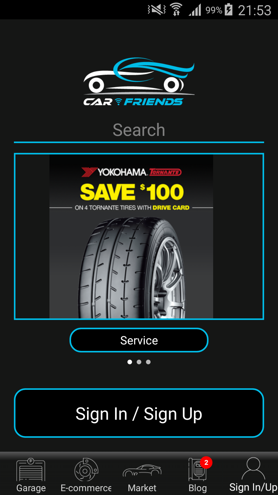

# Car_Friends_ReactNative
This is a car booking and e-commerce app

---

## Installation

1. Clone https://github.com/MobileDevStar/Car_Friends_ReactNative.git.
2. npm-install.
3. react-native run-android.

---

## Skills

1. React-Native
2. E-Commerce
3. Php Backend

---

## ScreenShot

<h3 align="center">

</h3>

